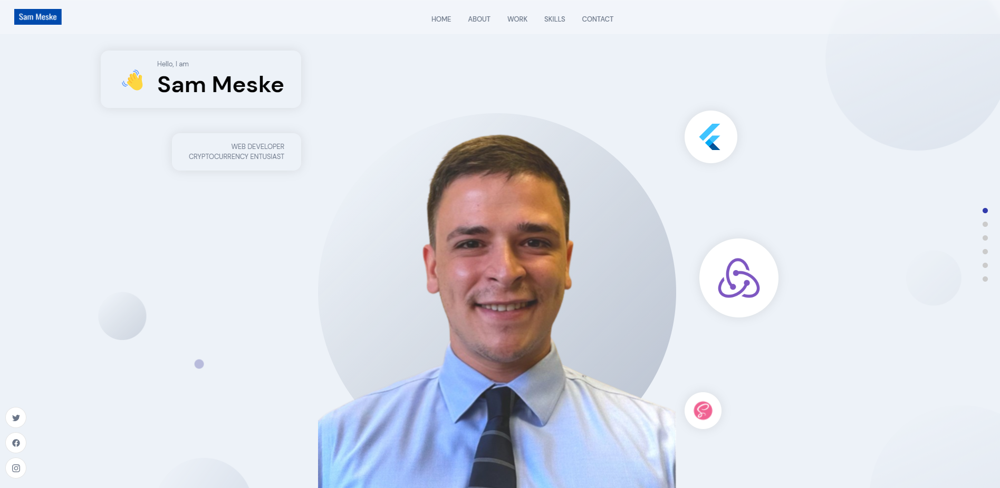

# My React Coding Portfolio

This full stack application built with ReactJS and Sanity allows users to explore my coding portfolio, learn about my skills as a developer, and add testimonials to the page. There is a form to contact me at the end of the application.

## Table of Contents

- [License](#license)
- [Installation](#installation)
- [Usage](#usage)
- [Features](#features)
- [Credits](#credits)
- [Tests](#tests)
- [Questions](#questions)
- [Contribute](#Contribute)

## License

- Unlicensed

Refer to [https://choosealicense.com/](https://choosealicense.com/).

## Installation

To install this application, please follow the steps below:

1. In the integrated terminal, on the parent, frontend_react and backend-sanity directories, run `npm i`
2. In the frontend_react terminal, run `npm run start`
3. Once the application starts, explore the features in Chrome

- EXTENSIONS:
  - ReactJS
  - React-dom
  - Sanity Client

## Usage

- GitHub: https://github.com/smeske10/React-Coding-Portfolio

## Credits

- This application uses [ReactJS](https://reactjs.org/docs/getting-started.html) and [Sanity](https://www.sanity.io/) to create a full stack web application.

## Questions

If you have any questions about the repo, open an issue or contact me directly at undefined. You can find more at [smeske10](https://github.com/smeske10/).

## Contribute

- Contact me directly at my GitHub

The [Contributor Covenant](https://www.contributor-covenant.org/) is an industry standard, but you can always write your own if you'd prefer.
